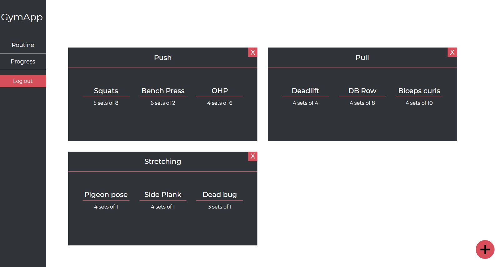

# Gym Progress App 🏋️

## How to start tracking
1. Visit website and create an account
2. Add your current workout routine
3. Add your sessions
4. Keep an eye on your progress

### Technologies 🔧 
+ [ReactJs](https://reactjs.org/)
+ [Redux](https://redux.js.org/)
+ [Firebase](https://firebase.google.com/)

### Major features
+ Protected routes
+ Authorization persistence

#### License ⚖️

[MIT](https://en.wikipedia.org/wiki/MIT_License)

#### Meta
Daniel Staszek - [github](https://github.com/stassiek02/) - [staszekdaniel5@gmail.com](mailto:staszekdaniel5@gmail.com)

https://github.com/stassiek02/Gym-progress-app/
